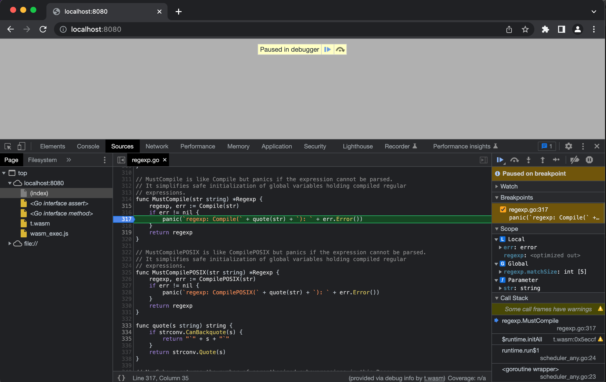

An interactive debugger is useful to better understand the behavior of an application or service by stepping through its code

WebAssembly (Wasm) executables compiled from Go source code can be interactively debugged in Chrome DevTools, as shown in the following screenshot:



Currently, the builtin Go compiler does not export [the debugging information needed by the Chrome debugger](https://yurydelendik.github.io/webassembly-dwarf/). The remainder fix to enable this functionality is described in [this changelog](https://go.googlesource.com/go/+/418ef9ce78ffe2c27341dacb6cbe88bc1787b797)

[TinyGo](https://tinygo.org) is an alternative compiler targeting the embedded and WebAssembly space. Contrary to the builtin Go compiler, **WebAssemblies from TinyGo can be debugged in Chrome DevTools**

## Compiling Go source to WebAssembly in TinyGo

When compiled by TinyGo and run in the browser, the following code prints `Go Web Assembly` to the log console and exports a `multiply` function which can be invoked from JavaScript:

```go
// main.go

package main

import "fmt"

func main() {
  fmt.Println("Go Web Assembly")
}

//export multiply
func multiply(x, y int) int {
  return x * y
}
```

Compile it to main.wasm with TinyGo:

```bash
tinygo build -o main.wasm main.go
```

## Run main.wasm in Chrome

`wasm_exec.js` contains helper functions provided by TinyGo. You'll find the file in the `targets` directory of the TinyGo install directory. Copy it to the directory where you compiled `main.wasm`:

```sh
cp $TINYGO_INSTALL_DIR/targets/wasm_exec.js .
```

Add the following html in the same directory and load it in Chrome:

```html
<html>

<head>
        <meta charset="utf-8" />
        <script src="wasm_exec.js"></script>
        <script>
                const go = new Go();
                const WASM_URL = 'main.wasm';

                var wasm;

                if ('instantiateStreaming' in WebAssembly) {
                        WebAssembly.instantiateStreaming(fetch(WASM_URL), go.importObject).then(function (obj) {
                                wasm = obj.instance;
                                go.run(wasm);
                        })
                } else {
                        fetch(WASM_URL).then(resp =>
                                resp.arrayBuffer()
                        ).then(bytes =>
                                WebAssembly.instantiate(bytes, go.importObject).then(function (obj) {
                                        wasm = obj.instance;
                                        go.run(wasm);
                                })
                        )
                }
        </script>
</head>

<body></body>

</html>
```

You should see the `Go Web Assembly` message in the DevTools console:


Invoke the `multiply` function from the DevTools console:


## Enable Go debugging in Chrome DevTools

A helper extension that integrates with Chrome DevTools is needed. Please install it by going to [this link](https://goo.gle/wasm-debugging-extension). Although its current name suggests otherwise, **the extension will work with Go sources**

Finally, enable WebAssembly debugging in the DevTools Experiments. Open Chrome DevTools, click the gear (⚙) icon in the top right corner of DevTools pane, go to the Experiments panel and tick `WebAssembly Debugging: Enable DWARF support`:


## Test Go debugging in Chrome DevTools

Make sure main.wasm is running in Chrome, [as explained earlier](#run-mainwasm-in-chrome)

In Chrome DevTools, open the `Sources` tab. In the `Pages` panel, open main.go from the `file://` tree. Add a breakpoint on the `fmt.Println("Go Web Assembly")` line:


Reload the page. The debugger should be paused on the `fmt.Println("Go Web Assembly")` line:


🚀

## References

- [TinyGo: Using WebAssembly](https://tinygo.org/docs/guides/webassembly)
- [Chrome DevTools engineering blog: Debugging WebAssembly with modern tools](https://developer.chrome.com/blog/wasm-debugging-2020/)
- [golang/go GitHub issue #33503: wasm: add DWARF sections](https://github.com/golang/go/issues/33503)
